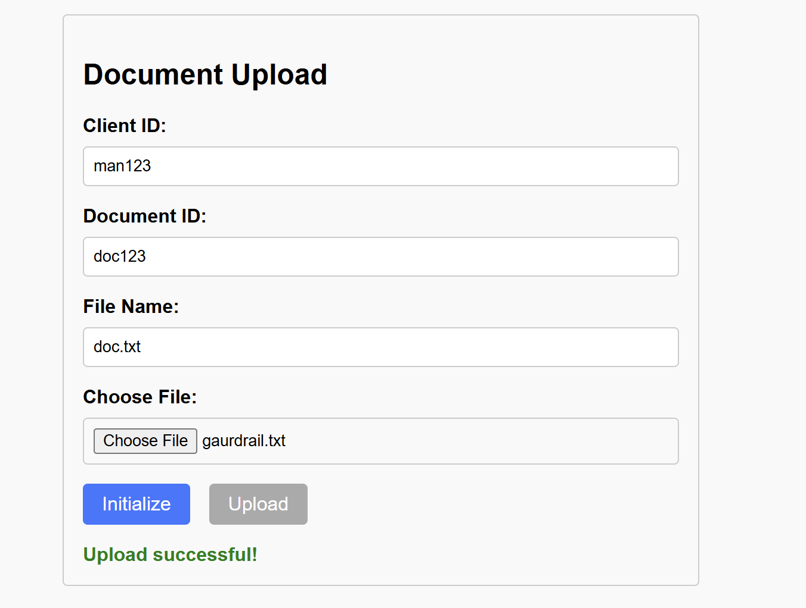

## Getting the presigned function
```python
import json
import boto3

client = boto3.client('s3')

def lambda_handler(event, context):
    
    if 'body' in event:
        body = json.loads(event['body'])
    else:
        body = event
    
    key = body['key']
    metadata = body['metadata']

    presignedUrl = client.generate_presigned_url(
        'put_object',
        Params={
            'Bucket': 'region1-metadata-assignment',
            'Key': key,
            'Metadata': metadata
        },
        ExpiresIn=300
    )
    
    return {
        'statusCode': 200,
        'body': json.dumps(presignedUrl),
        'headers': {
            'Access-Control-Allow-Origin': '*',
            'Access-Control-Allow-Methods': 'OPTIONS, POST',
            'Access-Control-Allow-Headers': 'Content-Type, x-amz-meta-*'
        }
    }
```

## Uploading File from lambda

```python
import json
import urllib3
import base64

http = urllib3.PoolManager()

def lambda_handler(event, context):
    
    try:
        if 'body' in event:
            body = json.loads(event['body'])
        else:
            body = event

        presigned_url = body.get('presigned_url')
        file_content = base64.b64decode(body.get('file_content'))
        metadata = body.get('metadata')

        if not presigned_url or not file_content or not metadata:
            return {
                'statusCode': 400,
                'body': json.dumps('Missing required fields'),
                'headers': {
                    'Access-Control-Allow-Origin': '*',
                    'Access-Control-Allow-Methods': 'OPTIONS, POST'
                }
            }

        headers = {}

        for key, value in metadata.items():
            headers[f'x-amz-meta-{key}'] = str(value)


        response = http.request(
            'PUT',
            presigned_url,
            body=file_content,
            headers=headers
        )

        if response.status != 200:
            return {
                'statusCode': response.status,
                'body': json.dumps('Upload Failed from lambda side'),
                'headers': {
                    'Access-Control-Allow-Origin': '*',
                    'Access-Control-Allow-Methods': 'OPTIONS, POST'
                }
            }

        return {
            'statusCode': 200,
            'body': json.dumps('Upload Successful'),
            'headers': {
                'Access-Control-Allow-Origin': '*',
                'Access-Control-Allow-Methods': 'OPTIONS, POST'
            }
        }
    
    except Exception as e:
        return {
            'statusCode': 400,
            'body': json.dumps(f'Upload Failed due to {e}'),
            'headers': {
                'Access-Control-Allow-Origin': '*',
                'Access-Control-Allow-Methods': 'OPTIONS, POST'
            }
        }
```

